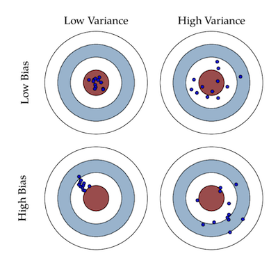

Some days ago I stumbled upon [this paper](https://homes.cs.washington.edu/~pedrod/papers/cacm12.pdf) by [Pedro Domingos](https://homes.cs.washington.edu/~pedrod/). I think everyone working with Machine Learning should read it: the core concepts of ML are laid out beautifully by the author.

1. **Learning = Representation + Evaluation + Optimization**

   Choosing a learning algorithm consists in choosing a *representation*, the type of model from the hypothesis space (decision tree, svm, random forest, neural network, ...); an *evaluation* method, a scalar target to measure the performance (accuracy, logloss, likelihood, KL divergence, ...); an *optimization* method, a technique to search the optimal model.

2. **It's generalization that counts**

   The **ultimate goal is accurate prediction on unseen data**. We don't know the real function to optimize and we use a surrogate to fit our model, but that's cool: it means we can settle for local optima and not be bothered. Remember to treat your test set respectfully!

3. **Data alone is not enough**

   Models must make **assumptions beyond the data to generalize well**. There are plenty of very general reasonable assumptions that are enough to make them work: smoothness, similar examples having similar classes, limited dependences, or limited complexity.
   
4. **Overfitting has many faces**

   Generalization error = consistently learning the same wrong thing  +  tendency to learn noise over the real signal.

 These two types of error are respectively called **bias** and **variance**.
   
   

5. **Intuition fails in high dimension**

   High dimension makes it harder to generalize, examples look alike and breaks our intuition based on 3D representation. Use dimensionality reduction techniques and do not worry: the samples usually concentrate on lower dimensional manifolds.
   
6. **Theoretical guarantees are not what they seem**

   Bounds are often very loose, change with the hypothesis space or work in the ideal asymptotic regime. They're a great source of understanding and algorithm design though.

7. **Feature engineering is the key**

   Feature engineering is often the hardest part, because it is domain specific, versus general purpose learners. The holy grail is feature engineering automation, but this process may often generate underfitting or overfitting.
   
8. **More data beats a cleverer algorithm**

   Quickest path to success is **gather more data**.

9. **Learn many models, not just one**

   Combining many variations of many learners gives better results.

10. **Simplicity does not imply accuracy**

   Simplicity of a model is a virtue by itself, but it's not connected to accuracy. 

11. **Representable does not imply learnable**

   *Every function can be represented, or approximated arbitrarily closely, using this representation*, but **representable != learnable**, e.g. in continuous spaces, representing simple functions using a fixed set of primitives might require an infinite number of components. If the hypothesis space has many local optima, we might never find the true function.

12. **Correlation does not imply causation**

   Correlation indicates a potential causal connection and we use it as a guide for deeper investigation. **If we can get experimental data to confirm our hypothesis** (e.g. through A/B Testing), **we should do so**.
